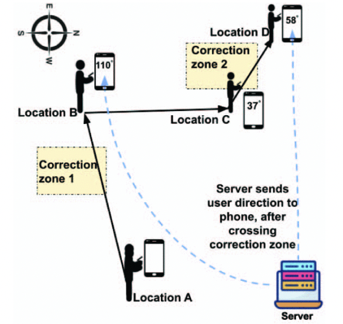

# SWidir

This is the official implementation for _SWiDir: Enhancing Smartphone-based Walking Direction Estimation with Passive WiFi Sensing_ accepted at MASS '23.
[[Paper]](https://drive.google.com/file/d/1uPdt7CdH3Zn_0uXA3-Ol2WQ02ktm_pxr/view?usp=drive_link)

Complete codebase for SWidir is coming up soon!

<div align="center">

</div>


# Overview

Dead reckoning is a promising yet overlooked smart-phone based indoor localization technology. It relies on phone-mounted sensors for counting steps and estimating walking directions, requiring no massive deployment of additional sensors or landmarks. However, it suffers from the misalignment between phone’s direction and human’s movement direction, which makes the estimated walking direction unreliable and eventually leads to inaccurate location estimation. To solve this problem, this paper introduces SWiDir, an approach that calibrates walking direction by integrating active smartphone sensing with passive WiFi sensing. SWiDir deploys a few WiFi devices to form a correction zone, and use their WiFi Channel State Information (CSI) to infer human’s movement inside the zone. We adopt the training-free WiFi Fresnel Zone model, and introduce an accurate and robust direction estimation model by exploring the geometrical relationship between the user’s movement and its impact on the Fresnel zones. We built our testbed with 4 Raspberry Pis, forming a large correction zone and evaluated SWiDir across 5 participants in 2 different real environments. Our extensive experiments show that SWiDir achieves 8.89 degrees of average 75 percentile error in walking direction estimation, which is 64% lower than the state-of-the-art existing approaches.

If you use our code, please consider citing our paper:
```
@INPROCEEDINGS{10298484,
  author={Mottakin, Khairul and Davuluri, Kiran and Song, Zheng},
  booktitle={2023 IEEE 20th International Conference on Mobile Ad Hoc and Smart Systems (MASS)}, 
  title={SWiDir: Enhancing Smartphone-based Walking Direction Estimation with Passive WiFi Sensing}, 
  year={2023},
  volume={},
  number={},
  pages={599-605},
  keywords={Legged locomotion;Location awareness;Dead reckoning;Estimation;Receivers;Sensor systems;Sensors;Walking Direction Estimation;Dead Reckoning;Smartphone Sensor Calibration;Channel State Information (CSI);WiFi Sensing},
  doi={10.1109/MASS58611.2023.00080}}
```
